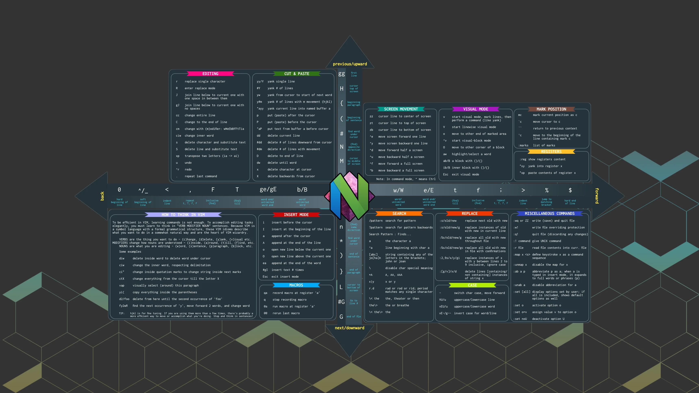

# 🧭 Keymapping

## 🦆 Neovim

| **Function**                                                                                         | **Shortcut**                                             |
| ---------------------------------------------------------------------------------------------------- | -------------------------------------------------------- |
| **Cursor Movement**                                                                                  |                                                          |
| Arrow Keys                                                                                           | `h`, `j`, `k`, `l`                                       |
| Next / Previous Word                                                                                 | `w`, `b`                                                 |
| Next / Previous End of Word                                                                          | `e`, `ge`                                                |
| Move Forward / Backward to Character                                                                 | `f[char]`, `F[char]`                                     |
| Start / End of Line                                                                                  | `0`, `$`                                                 |
| First Non-Blank Character of Line                                                                    | `_`, or `^`                                              |
| Move Down / Up Half a Page                                                                           | `Ctrl` + `d` / `u`                                       |
| Next / Previous Blank Line                                                                           | `}`, `{`                                                 |
| Top / Bottom of File                                                                                 | `gg`, `G`                                                |
| Goto Line                                                                                            | `:[num]<cr>`                                             |
| Goto Definition, Reference, Implementation                                                           | `gd`, `gr`, `gI`                                         |
| LSP Hover Documentation                                                                              | `K`                                                      |
| **Editing**                                                                                          |                                                          |
| Undo / Undo Tree                                                                                     | `u` / `<leader>u`                                        |
| Redo                                                                                                 | `Ctrl` + `r`                                             |
| Insert Mode At / After Cursor                                                                        | `i`, `a`                                                 |
| Insert Mode at Beginning / End of Line                                                               | `I`, `A`                                                 |
| Insert Blank Line After / Above                                                                      | `o`, `O`                                                 |
| Delete Current Character                                                                             | `x`                                                      |
| Delete / Delete into Void Register                                                                   | `d`, `<leader>d`                                         |
| Delete Line / Delete Line into Void Register                                                         | `dd`, `<leader>dd`                                       |
| Delete then Start Insert Mode                                                                        | `c`                                                      |
| Delete Line then Start Insert Mode                                                                   | `cc`                                                     |
| Change...                                                                                            | `c` + `[char]`                                           |
| Surrounding...                                                                                       | `s` + `[char]`                                           |
| Yank / Yank into Void Register                                                                       | `y`, `<leader>y`                                         |
| Yank Line / Yank Line into Void Register                                                             | `yy`, `<leader>yy`                                       |
| Paste After / Before Cursor                                                                          | `p`, `P`                                                 |
| Replace Current Word                                                                                 | `<leader>rw`                                             |
| Rename using LSP                                                                                     | `<leader>rn`                                             |
| Replace All Old with New within Buffer (with confirmations)                                          | `:%s/old/new/g` (+`c`)                                   |
| In Visual Mode, Move Highlighted Text Up / Down                                                      | `J`, `K`                                                 |
| **Searching, Git, File Tree, Splits and Windows**                                                    |                                                          |
| Search Within Current Buffer / Search Backwards                                                      | `/[query]`, `?[query]`                                   |
| Repeat Search in Same / Opposite Direction                                                           | `n`, `N`                                                 |
| Search Files, Recent Files, Open Files, Grep, Diagnostics, Help, Keymaps, Neovim Files, Zoxide, etc. | `<leader>s` + `f`, `.`, `/`, `g`, `d`, `h`, `k`, `z` `n` |
| Add Buffer to Harpoon                                                                                | `<leader>a`                                              |
| Open Harpoon Quick Menu / Telescope Menu                                                             | `<leader>h` / `Ctrl` + `e`                               |
| Harpoon Quick Navigate                                                                               | `<leader>` + `1`, `2`, `3`, `4`, `5`                     |
| Open in `oil.nvim`                                                                                   | `<leader>` + `-`                                         |
| Open in `telescope-file-browser.nvim`                                                                | `Ctrl` + `f`                                             |
| Open, Split Windows...                                                                               | `Ctrl` + `w` + `[char]`                                  |
| Close Split                                                                                          | `Ctrl` + `w` +`q`                                        |
| Navigate Splits                                                                                      | `Ctrl` + `h`, `j`, `k`, `l`                              |
| Diagnostic Messages / Quickfix / Trouble                                                             | `<leader>` + `e` / `q` / `x`                             |
| Previous / Next Tab Page                                                                             | `Shift + Tab` / `Tab`                                    |
| Close Tab                                                                                            | `Ctrl` + `q`                                             |



## 🔎 fzf

| **Function**           | **Shortcut**                          |
| ---------------------- | ------------------------------------- |
| Search Files           | `Ctrl` + `t` and type the search term |
| Search Command History | `Ctrl` + `r` and type the search term |
| Search Directories     | `Alt` + `c` and type the search term  |
| Trigger Fuzzy Find     | `**` + `Tab` and type the search term |

## 💻 Wezterm

```bash
# Display key bindings
wezterm show-keys
```

```bash
# Connect to NAS
wezterm connect tnas
```

| **Function**                          | **Modifier**      |                 | **Key**                                                                   |
| ------------------------------------- | ----------------- | --------------- | ------------------------------------------------------------------------- |
|                                       | **Windows**       | **Mac**         |                                                                           |
| Toggle Full Screen                    | `Alt`             | `Alt`           | `Enter`                                                                   |
| Scroll Up / Down                      | `Ctrl` + `Shift`  | `⌘` + `Shift`   | `k` / `j`                                                                 |
| Font Size Increase / Decrease / Reset | `Ctrl` + `Shift`  | `Super`         | `+` / `-` / `0`                                                           |
| **Sessions**                          |                   |                 |                                                                           |
| Save Session                          | `Ctrl` + `Shift`  | `⌘`             | `]`                                                                       |
| Restore Session                       | `Ctrl` + `Shift`  | `⌘`             | `[`                                                                       |
| **Splitting**                         |                   |                 |                                                                           |
| Smart Split                           | `Ctrl` + `Shift`  | `⌘` + `Shift`   | `Enter`                                                                   |
| Split Vertically                      | `Ctrl` + `Shift`  | `⌘` + `Shift`   | `\|`                                                                      |
| Split Horizontally                    | `Ctrl` + `Shift`  | `⌘` + `Shift`   | `_`                                                                       |
| Close Split                           | `Ctrl` or `Alt`   | `Ctrl` or `Alt` | `Backspace`                                                               |
| Activate Left / Down / Up / Right     | `Ctrl`            | `Ctrl`          | `h`, `j` / `k` / `l`                                                      |
| Resize Left / Down / Up / Right       | `Alt`             | `Alt`           | `h`, `j` / `k` / `l`<br>`LeftArrow`, `DownArrow`, `UpArrow`, `RightArrow` |
| Zoom (Maximize) Pane                  | `Alt`             | `Alt`           | `m`                                                                       |
| Rotate Panes                          | `Ctrl` + `Shift`  | `⌘` + `Shift`   | `R`                                                                       |
| Swap Panes                            | `Ctrl` + `Shift`  | `⌘` + `Shift`   | `S`                                                                       |
| **Tabs**                              |                   |                 |                                                                           |
| New Tab                               | `Ctrl` + `Shift`  | `⌘`             | `t`                                                                       |
| Close Tab                             | `Ctrl` + `Shift`  | `⌘`             | `w`                                                                       |
| Select Tab                            | `Ctrl`            | `Ctrl`          | `#`                                                                       |
| Tab Previous / Tab Next               | `Ctrl` + `Shift`  | `⌘` + `Shift`   | `h` / `l`                                                                 |
| Move Tab Left / Right                 | `Ctrl` + `Shift`  | `⌘` + `Shift`   | `<` / `>`                                                                 |
| **Clipboard**                         |                   |                 |                                                                           |
| Copy                                  | `Ctrl` + `Shift`  | `⌘`             | `c`                                                                       |
| Paste                                 | `Ctrl` + `Shift`  | `⌘`             | `v`                                                                       |
| Quick Select                          | `Ctrl` + `Shift`  | `⌘` + `Shift`   | `Space`                                                                   |
| Copy Mode                             | `Ctrl` + `Shift`  | `⌘` + `Shift`   | `X`                                                                       |
| Search                                | `Ctrl` + `Shift`  | `⌘` + `Shift`   | `F`                                                                       |
| Command Palette                       | `Ctrl` + `Shift`v | `⌘` + `Shift`   | `P`                                                                       |
| Debug Overlay                         | `Ctrl` + `Shift`  | `⌘` + `Shift`   | `D`                                                                       |

## 🪁 Yabai and Skhd

| **Function**                                 | **Shortcut**                                  |
| -------------------------------------------  | --------------------------------------------- |
| Activate Left / Down / Up / Right            | `Ctrl` + `h`, `j`, `k`, `l`                   |
| Switch to Workspace 1 / 2 / 3 / 4 / 5        | `⌘` + `1` / `2` / `3` / `4` / `5`             |
| Move Window to Workspace 1 / 2 / 3 / 4 / 5   | `Shift` + `Alt` + `1` / `2` / `3` / `4` / `5` |
| Toggle Full Screen                           | `Alt` + `Enter`                               |
| Rotate Clockwise                             | `Shift` + `Alt` + `r`                         |
| Mirror x / y Axis                            | `Shift` + `Alt` + `x` / `y`                   |
| Toggle Float                                 | `Shift` + `Alt` + `Space`                     |
| Rebalance Workspace                          | `Alt` + `e`                                   |
| Resize Left / Down / Up / Right              | `Alt` + `h`, `j`, `k`, `l`                    |
| Swap Left / Down / Up / Right                | `Shift` + `Alt` + `h`, `j`, `k`, `l`          |
| Move Window and Tile with Existing Workspace | `Ctrl` + `Alt` + `h`, `j`, `k`, `l`           |
| Stop Yabai Service                           | `Ctrl` + `Alt` + `q`                          |
| Start Yabai Service                          | `Ctrl` + `Alt` + `s`                          |
| Restart Yabai Service                        | `Ctrl` + `Alt` + `r`                          |
