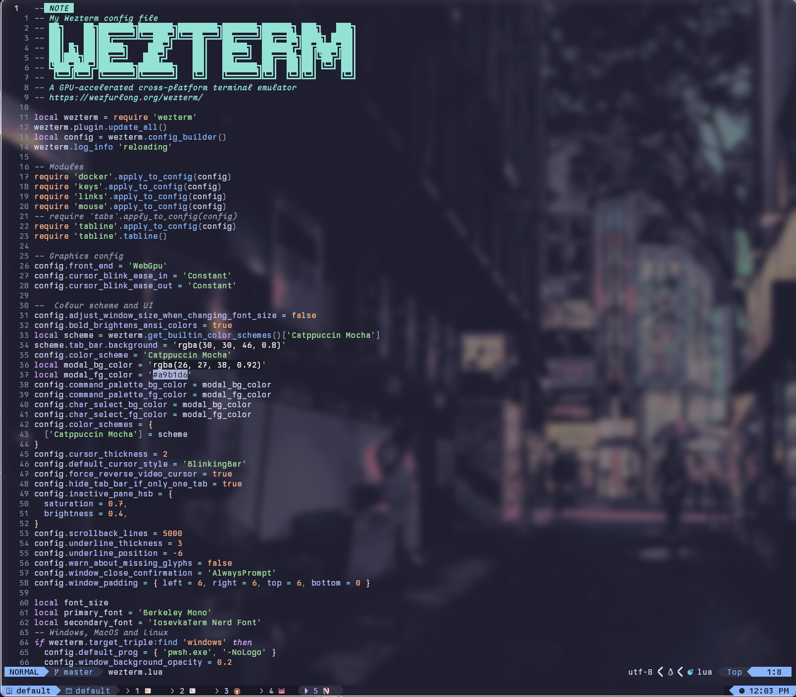
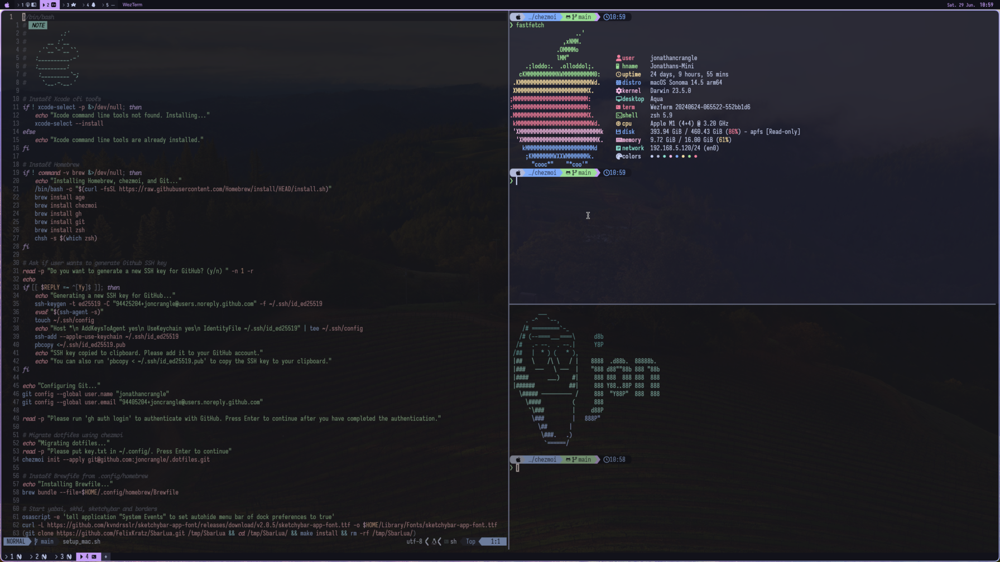
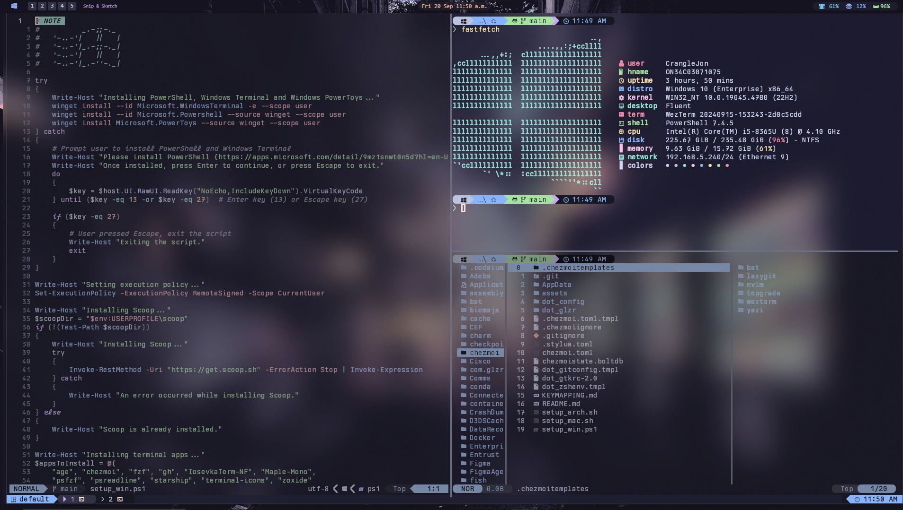
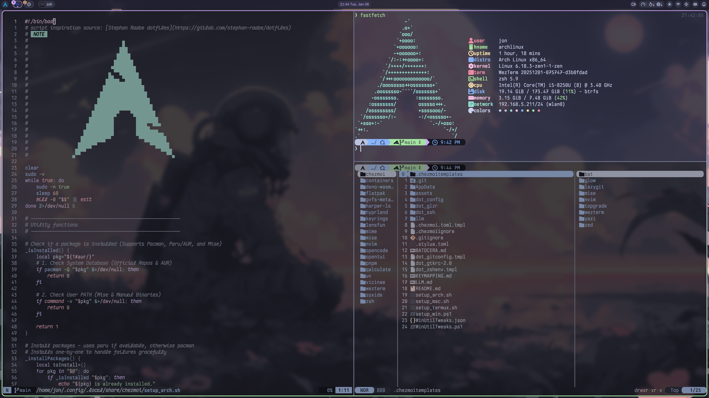

# .dotfiles

<!--toc:start-->
- [.dotfiles](#dotfiles)
  - [📘 Overview](#-overview)
  - [🍎 MacOS](#-macos)
  - [🪟 Windows](#-windows)
  - [🐧 Arch Linux](#-arch-linux)
    - [Paru commands](#paru-commands)
  - [🧭 Keymapping](#-keymapping)
<!--toc:end-->






## 📘 Overview

This `.dotfiles` repository contains my macOS, Arch Linux and Windows system configurations.

Features include:

**Common**

- [Catppuccin](https://github.com/catppuccin) theme
- [chezmoi](https://chezmoi.io/) to manage dotfiles across systems
- [Neovim](https://neovim.io/) a cross-platform editor
- [Starship](https://starship.rs/) prompt
- [WezTerm](https://wezfurlong.org/wezterm/) a cross-platform terminal emulator
- [Yazi](https://github.com/sxyazi/yazi) terminal file manager. Plugins can be updated with `ya pack -u`.
- A configured `zsh` shell for macOS and Linux, and `PowerShell` for Windows with autocompletion, history, and syntax highlighting
- Fuzzy finding with [fzf](https://github.com/junegunn/fzf)

**MacOS**

- [Yabai](https://github.com/koekeishiya/yabai) window manager
- [skhd](https://github.com/koekeishiya/skhd) keyboard shortcuts
- [SketchyBar](https://github.com/FelixKratz/SketchyBar) bar
- [JankyBorders](https://github.com/FelixKratz/JankyBorders) border styling
- [Raycast](https://www.raycast.com/) launcher
- [Homebrew](https://brew.sh/) package management

**Windows**

- [Komorebi](https://github.com/LGUG2Z/komorebi) window manager
- [Zebar](https://github.com/glzr-io/zebar) bar
- Microsoft PowerToys for launcher, keyboard shortcuts and various extras
- [Scoop](https://scoop.sh/) package management

**Arch Linux**

- [Hyprland](https://hyprland.org/) window manager
- [Aylur's GTK Shell](https://github.com/Aylur/ags) for bar, launcher and notifications
- [Paru](https://github.com/Morganamilo/paru) AUR helper (package management)

> [!WARNING]
> Change the git username, email, and ssh keygen email in `setup_arch.sh`, `setup_mac.sh` and `setup_win.ps1` to your own.
> Change `banner.zsh` and the banner in `setup_win.ps1` to your own banner image.
> If you have existing ssh keys, ensure to copy them to the $HOME/.ssh directory.

> [!IMPORTANT]
> Move `key.txt` encryption key to the `$HOME/.config` directory to decrypt encrypted files.

### 🍎 MacOS

1. Disable system integrity protection. [Yabai instructions](https://github.com/koekeishiya/yabai/wiki/Disabling-System-Integrity-Protection)

    - Turn off system. Hold power button until "Loading startup options" appears. Click "Options" then click "Continue"
    - In the menu bar, choose `Utilities`, then `Terminal`

    ```sh
    # If you're on Apple Silicon macOS 13.x.x
    # Requires Filesystem Protections, Debugging Restrictions and NVRAM Protection to be disabled
    # (printed warning can be safely ignored)
    csrutil enable --without fs --without debug --without nvram
    ```

    - Reboot. For Apple Silicon, need to enable non-Apple-signed arm64e binaries.

    ```sh
    # Open a terminal and run the below command, then reboot
    sudo nvram boot-args=-arm64e_preview_abi
    ```

2. Create 5 workspaces. Open `System Settings` -> `Keyboard` -> `Keyboard Shortcuts`. Enable the `Mission Control` shortcuts, including `⌘` + `#` and `⌃` + `<-` / `->` to to switch between workspaces.

3. Open `System Settings` -> `Privacy & Security` -> `Accessibility`. Click the + button at the bottom left of the list view and enter your password to allow changes to the list.

4. Give `Terminal` full disk access through `Security & Privacy` -> `Privacy` -> `Full Disk Access`.

5. Download and run the [setup_mac.sh](https://github.com/joncrangle/.dotfiles/raw/main/setup_mac.sh) shell script.

```sh
curl -L https://raw.githubusercontent.com/joncrangle/.dotfiles/main/setup_mac.sh | sh
```

> [!TIP]
> If needed, make the script executable with
>
> ```sh
> chmod +x setup_mac.sh
> ```

6. The macOS setup process will begin by installing [Homebrew](https://brew.sh/), [chezmoi](https://chezmoi.io/), and Git.

7. Setup will walk you through authenticating with Github. It will then install the dotfiles and apps.

8. Give `WezTerm` full disk access through `Security & Privacy` -> `Privacy` -> `Full Disk Access`. Hide the menu bar in `System Settings` -> `Control Center` -> Automatically hide and show the menu bar -> Always.

9. Give `Yabai`, `Wezterm`, `skhd` accessibility permissions in `System Preferences` -> `Security & Privacy` -> `Accessibility`.

10. Launch the `Shortcuts` app. Create a shortcut called "playpause" with "Play/Pause" from the "Media" category. This shortcut will be used by the bar for playback control.

11. Launch the `Stats` app. Configure the Disk, RAM and CPU monitors widgets to be Center aligned with color "Second yellow".

## 🪟 Windows

1. Download and run the [setup_win.ps1](https://github.com/joncrangle/.dotfiles/raw/main/setup_win.ps1) PowerShell script.

```pwsh
iwr -useb https://raw.githubusercontent.com/joncrangle/.dotfiles/main/setup_win.ps1 | iex
```

> [!TIP]
> You might need to change the execution policy to `RemoteSigned` before running the script.
>
> ```pwsh
> Set-ExecutionPolicy -ExecutionPolicy Unrestricted -Scope CurrentUser
> ```

2. The Windows setup process will begin by trying to install [PowerShell](https://apps.microsoft.com/detail/9mz1snwt0n5d?hl=en-US&gl=US), [Windows Terminal](https://apps.microsoft.com/detail/9n0dx20hk701?hl=en-US&gl=US) and [PowerToys](https://apps.microsoft.com/detail/xp89dcgq3k6vld?hl=en-US&gl=US).

3. Setup will then proceed to install [Scoop](https://scoop.sh/), [chezmoi](https://chezmoi.io/), Git and terminal apps.

4. After you authenticate with GitHub, it will install the dotfiles, configure PowerShell, and install apps.

> [!TIP]
> Some useful PowerToys settings that can be configured:
>
> 1. Enable FancyZones
> 2. File Explorer add-ons for previews
> 3. Enable Keyboard Manager and remap `Ctrl` + `F` to `F4` within `outlook`
>    Remap `Ctrl` + `Shift` + `O` and `Ctrl` + `Shift` + `M` to camera and microphone toggle buttons in `ms-teams`
> 4. Enable Paste as Plain Text
> 5. Enable PowerToys Run (adds Spotlight capability for Windows)
> 6. Enable Quick Accent for a desired language (e.g. French or Spanish)
>
> Within Taskbar Settings, automatically hide the taskbar in Desktop mode.

> [!TIP]
> To update the Komorebi application rules, run `komorebic fetch-asc`.

## 🐧 Arch Linux

Install Arch using `archinstall` with a Minimal profile. To connect to wifi, use `iwctl`:

```sh
iwctl
device list
station wlan0 scan
station wlan0 get-networks
station wlan0 connect SSID
exit
archinstall
```

Once installed, connect to wifi and run the setup script:

```sh
nmcli device wifi list
nmcli device wifi connect SSID password PASSWORD
sh <(curl -s https://raw.githubusercontent.com/joncrangle/.dotfiles/main/setup_arch.sh)
```

> [!TIP]
> KDE Plasma and Hyprland configs can clash. A workaround is to initiate sessions with different `XDG_CONFIG_HOME` variables.
>
> This script uses the `.kdeconfig` directory for KDE Plasma, and the `.config` directory for Hyprland.
>
> *Requires sudo permissions*
>
> 1. Create a `launch.sh` script in `/usr/share/wayland-sessions` and make it executable with `chmod +x launch.sh`:
>
> ```sh
> #!/bin/sh
> if [ -z "$1" ]; then
>      echo "Usage: $0 <config_directory> <command>"
>      exit 1
> fi
>
> export XDG_CONFIG_HOME="$HOME/$1"
>
> shift
>
> exec "$@"
> ```
>
> 2. Edit `plasma.desktop` in `/usr/share/wayland-sessions`:
>
> ```sh
> # Comment out existing Exec and TryExec lines and add:
> Exec=/usr/share/wayland-sessions/launch.sh .kdeconfig /usr/lib/plasma-dbus-run-session-if-needed /usr/bin/startplasma-wayland
>```
>
> 3. Edit `hyprland.desktop` in `/usr/share/wayland-sessions`:
>
> ```sh
> # Comment out existing Exec line and add:
> Exec=/usr/share/wayland-sessions/launch.sh .config Hyprland
> ```

### Paru commands

Install a package

```sh
paru -S <package>
```

Clean package cache

```sh
paru -Scd
```

Remove orphaned packages

```sh
paru -Qdtq | paru -Rns
```

## 🧭 Keymapping

See [Keymapping](KEYMAPPING.md).
