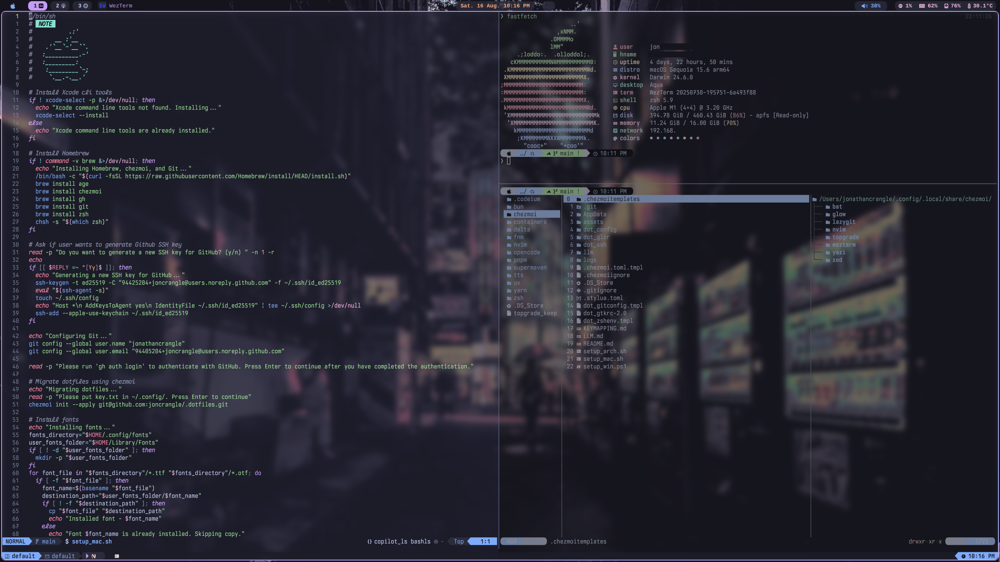
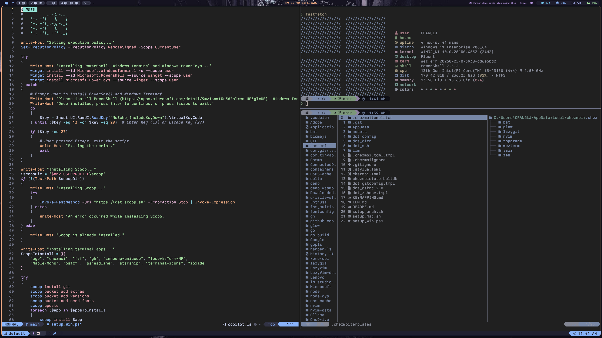
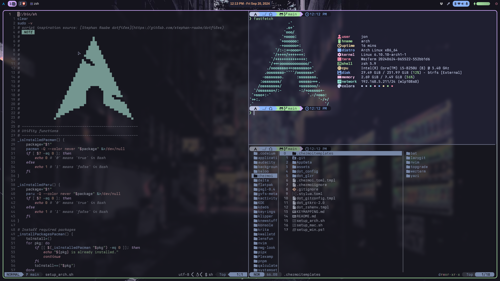

# .dotfiles

<!--toc:start-->
- [.dotfiles](#dotfiles)
  - [📘 Overview](#📘-overview)
    - [🍎 MacOS](#🍎-macos)
  - [🪟 Windows](#🪟-windows)
  - [📱 Termux (Android)](#📱-termux-android)
  - [🐧 Arch Linux](#🐧-arch-linux)
    - [Paru commands](#paru-commands)
  - [🧭 Keymapping](#🧭-keymapping)
<!--toc:end-->







## 📘 Overview

This `.dotfiles` repository contains my macOS, Arch Linux and Windows system configurations.

Features include:

**Common**

- [Catppuccin](https://github.com/catppuccin) theme
- [chezmoi](https://chezmoi.io/) to manage dotfiles across systems
- [mise](https://mise.jdx.dev/) for managing dev tools, runtimes (Node, Python, Go, Rust), and environment variables
- [Neovim](https://neovim.io/) a cross-platform editor
- [Starship](https://starship.rs/) prompt
- [WezTerm](https://wezfurlong.org/wezterm/) a cross-platform terminal emulator
- [Yazi](https://github.com/sxyazi/yazi) terminal file manager.
- A configured `zsh` shell for macOS and Linux, and `PowerShell` for Windows with autocompletion, history, and syntax highlighting
- Fuzzy finding with [fzf](https://github.com/junegunn/fzf)

**MacOS**

- [Aerospace](https://nikitabobko.github.io/AeroSpace/guide) window manager
- [SketchyBar](https://github.com/FelixKratz/SketchyBar) bar
- [JankyBorders](https://github.com/FelixKratz/JankyBorders) border styling
- [Raycast](https://www.raycast.com/) launcher
- [Homebrew](https://brew.sh/) package management

**Windows**

- [GlazeWM](https://github.com/glzr-io/glazewm) window manager
- [Zebar](https://github.com/glzr-io/zebar) bar (with [sketchybar-app-font](https://github.com/kvndrsslr/sketchybar-app-font) icons)
- Microsoft PowerToys for launcher, keyboard shortcuts and various extras
- [Scoop](https://scoop.sh/) package management

**Arch Linux**

- [Hyprland](https://hyprland.org/) window manager
- [Noctalia Shell](https://github.com/noctalia-shell/noctalia-shell) for bar, lock screen, control center, notifications, and screen recorder
- [Vicinae](https://github.com/noctalia-shell/vicinae) launcher
- [Paru](https://github.com/Morganamilo/paru) AUR helper (package management)

> [!WARNING]
> Change the git username, email, and ssh keygen email in `setup_arch.sh`, `setup_mac.sh` and `setup_win.ps1` to your own.
> Change `banner.zsh` and the banner in `setup_win.ps1` to your own banner image.
> If you have existing ssh keys, ensure to copy them to the $HOME/.ssh directory.

> [!IMPORTANT]
> Move `key.txt` encryption key to the `$HOME/.config` directory to decrypt encrypted files.

### 🍎 MacOS

1. Remove mission control shortcuts. Open `System Settings` -> `Keyboard` -> `Keyboard Shortcuts`. Disable the `Mission Control` shortcuts, including `⌘` + `#` to switch between workspaces.

2. Open `System Settings` -> `Privacy & Security` -> `Accessibility`. Click the + button at the bottom left of the list view and enter your password to allow changes to the list.

3. Give `Terminal` full disk access through `Security & Privacy` -> `Privacy` -> `Full Disk Access`.

4. Download and run the [setup_mac.sh](https://github.com/joncrangle/.dotfiles/raw/main/setup_mac.sh) shell script.

```zsh
curl -L https://raw.githubusercontent.com/joncrangle/.dotfiles/main/setup_mac.sh | sh
```

> [!TIP]
> If needed, make the script executable with
>
> ```zsh
> chmod +x setup_mac.sh
> ```

5. The macOS setup process will begin by installing [Homebrew](https://brew.sh/), [chezmoi](https://chezmoi.io/), and Git.

6. Setup will walk you through authenticating with Github. It will then install the dotfiles and apps.

7. Give `WezTerm` full disk access through `Security & Privacy` -> `Privacy` -> `Full Disk Access`. Hide the menu bar in `System Settings` -> `Control Center` -> Automatically hide and show the menu bar -> Always.

8. Give `Aerospace`, `Wezterm`, `skhd` accessibility permissions in `System Preferences` -> `Security & Privacy` -> `Accessibility`.

10. Launch the `Shortcuts` app. Create a shortcut called "playpause" with "Play/Pause" from the "Media" category. This shortcut will be used by the bar for playback control.

## 🪟 Windows

1. Download and run the [setup_win.ps1](https://github.com/joncrangle/.dotfiles/raw/main/setup_win.ps1) PowerShell script.

```ps1
iwr -useb https://raw.githubusercontent.com/joncrangle/.dotfiles/main/setup_win.ps1 | iex
```

> [!TIP]
> You might need to change the execution policy to `RemoteSigned` before running the script.
>
> ```ps1
> Set-ExecutionPolicy -ExecutionPolicy Unrestricted -Scope CurrentUser
> ```

2. The Windows setup process will begin by trying to install [PowerShell](https://apps.microsoft.com/detail/9mz1snwt0n5d?hl=en-US&gl=US), [Windows Terminal](https://apps.microsoft.com/detail/9n0dx20hk701?hl=en-US&gl=US) and [PowerToys](https://apps.microsoft.com/detail/xp89dcgq3k6vld?hl=en-US&gl=US).

3. Setup will then proceed to install [Scoop](https://scoop.sh/), [chezmoi](https://chezmoi.io/), Git and terminal apps.

4. After you authenticate with GitHub, it will install the dotfiles, configure PowerShell, and install apps.

> [!TIP]
> Some useful PowerToys settings that can be configured:
>
> 1. File Explorer add-ons for previews
> 2. Enable Keyboard Manager and remap `Ctrl` + `F` to `F4` within `outlook`
>    Remap `Ctrl` + `Shift` + `O` and `Ctrl` + `Shift` + `M` to camera and microphone toggle buttons in `ms-teams`
>    Remap `Down` and `Up` to `Ctrl` + `N` and `Ctrl` + `P` for `powertoys.powerlauncher`
> 3. Enable Paste as Plain Text
> 4. Enable PowerToys Command Palette (optional)
> 5. Enable Quick Accent for a desired language (e.g. French or Spanish)
>
> Within Taskbar Settings, automatically hide the taskbar in Desktop mode.

## 📱 Termux (Android)

1. Install `Termux` using F-Droid. Also install `Termux:API` and `Termux:Styling`.
2. Open `Termux` and run:

```bash
pkg update && pkg upgrade -y
pkg install -y curl
bash <(curl -fsSL https://raw.githubusercontent.com/joncrangle/.dotfiles/main/install_termux.sh)
```

3. Import Neovim config.

## 🐧 Arch Linux

Install Arch using `archinstall` with a Minimal profile. To connect to wifi, use `iwctl`:

```bash
iwctl
device list
station wlan0 scan
station wlan0 get-networks
station wlan0 connect SSID
exit
archinstall
```

Once installed, connect to wifi and run the setup script:

```bash
sh <(curl -s https://raw.githubusercontent.com/joncrangle/.dotfiles/main/setup_arch.sh)
```

### Paru commands

Install a package

```zsh
paru -S <package>
```

Clean package cache

```zsh
paru -Scd
```

Remove orphaned packages

```zsh
paru -Qdtq | paru -Rns
```

## 🧭 Keymapping

See [Keymapping](KEYMAPPING.md).
